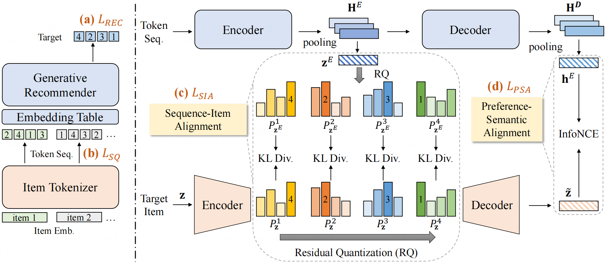

# ETEGRec

This is the official PyTorch implementation for the paper:

> [Generative Recommender with End-to-End Learnable Item Tokenization](https://doi.org/10.1145/3726302.3729989)

## Overview

We propose **ETEGRec**, a novel **E**nd-**T**o-**E**nd **G**enerative **Rec**ommender that unifies item tokenization and generative recommendation into a cohesive framework. Built on a dual encoder-decoder architecture, ETEGRec consists of an item tokenizer and a generative recommender. To enable synergistic interaction between these components, we propose a recommendation-oriented alignment strategy, which includes two key optimization objectives: sequence-item alignment and preference-semantic alignment. These objectives tightly couple the learning processes of the item tokenizer and the generative recommender, fostering mutual enhancement. Additionally, we develop an alternating optimization technique to ensure stable and efficient end-to-end training of the entire framework.



## Requirements

```bash
pip install -r requirements.txt
```

Key dependencies:
- `torch==2.4.0+cu121`
- `numpy`
- `accelerate`
- `faiss-gpu`
- `recbole`
- `transformers`
- `sentence-transformers`

## Quick Start

### Option 1: Use Pre-processed Data (Recommended)

Download the pre-processed data from [Google Drive](https://drive.google.com/drive/folders/1KiPpB7uq7eFc4qB74cFOxhtY3H8nWgAI?usp=sharing):
- SASRec embeddings
- Pretrained RQVAE weights
- Interaction data (train/valid/test splits)

Then skip to [Step 3: Joint Training](#step-3-joint-training-tokenizer--recommender).

### Option 2: Process Data from Scratch

Follow the complete pipeline below.

---

## Complete Training Pipeline

### Step 1: Data Preparation

Process raw Amazon review data into the required format:

```bash
cd RecBole

# For Amazon Musical Instruments 2018
python prepare_data_2018.py

# For other datasets, use the corresponding script:
# python prepare_data_2014.py  # For 2014 version
```

**What this does:**
- Loads raw Amazon JSON data
- Filters users/items with minimum 5 interactions
- Splits data into train/valid/test (leave-one-out)
- Generates `.inter` file for RecBole and `.jsonl` files for ETEGRec

**Output files** (in `RecBole/dataset/<DATASET_NAME>/`):
- `<DATASET_NAME>.inter` - RecBole format with split labels
- `<DATASET_NAME>.train.jsonl` - Training sequences
- `<DATASET_NAME>.valid.jsonl` - Validation sequences
- `<DATASET_NAME>.test.jsonl` - Test sequences

### Step 2: Generate Embeddings

#### 2.1 Generate Collaborative Embeddings (SASRec)

Train SASRec to generate item collaborative embeddings:

```bash
cd RecBole
python train_sasrec.py
```

**What this does:**
- Trains SASRec on the training set
- Uses validation set for early stopping
- Extracts item embeddings from the trained model

**Output files** (in `RecBole/dataset/<DATASET_NAME>/`):
- `<DATASET_NAME>_emb_256.npy` - Item collaborative embeddings (256-dim)
- `<DATASET_NAME>.emb_map.json` - Item ID to embedding index mapping

**Key parameters to modify** (in `train_sasrec.py`):
```python
BASE_DIR = './dataset/Instrument2018_5090'  # Change dataset path
DATASET_NAME = 'Instrument2018_5090'        # Change dataset name
```

#### 2.2 Generate Semantic Embeddings (Text)

Generate text-based semantic embeddings using sentence transformers:

```bash
cd RecBole
python generate_text_embeddings.py
```

**What this does:**
- Loads item metadata (titles, descriptions)
- Generates semantic embeddings using sentence-transformers
- Saves embeddings aligned with collaborative embeddings

**Output files** (in `RecBole/dataset/<DATASET_NAME>/`):
- `<DATASET_NAME>_sentence-transformer_text_768.npy` - Semantic embeddings (768-dim)

**Key parameters to modify** (in `generate_text_embeddings.py`):
```python
DATASET_NAME = 'Instrument2018_5090'
MODEL_NAME = 'sentence-transformers/all-MiniLM-L6-v2'  # Or other models
```

### Step 3: Pretrain RQVAE (Item Tokenizer)

Train the Residual Quantized Variational AutoEncoder for item tokenization:

```bash
cd RQVAE

# Option A: Single embedding (collaborative only)
bash run_pretrain.sh

# Option B: Dual embeddings (collaborative + semantic) - Recommended
bash run_dual.sh
```

**Key parameters to modify** (in `run_pretrain.sh` or `run_dual.sh`):

```bash
# Dataset paths
COLLAB_PATH="../RecBole/dataset/Instrument2018_5090/Instrument2018_5090_emb_256.npy"
SEMANTIC_PATH="../RecBole/dataset/Instrument2018_5090/Instrument2018_5090_sentence-transformer_text_768.npy"

# Model architecture
--num_emb_list 256 256 256    # Codebook sizes for each RQ layer
--layers 1024 512 256          # Encoder/decoder hidden dimensions
--e_dim 128                    # Embedding dimension

# Training
--batch_size 2048              # Adjust based on GPU memory
--epochs 10000                 # Max epochs (early stopping enabled)
--device cuda:0                # GPU device
```

**Output files** (in `RQVAE/rqvae_ckpt/<DATASET_NAME>/`):
- `best_collision_*.pth` - Best model checkpoint (lowest collision rate)
- `best_gini_*.pth` - Best model checkpoint (best codebook utilization)

**Monitoring:**
- Collision rate: Lower is better (target < 1%)
- Gini coefficient: Lower is better (more uniform codebook usage)

### Step 4: Joint Training (Tokenizer + Recommender)

Train the complete ETEGRec model with end-to-end optimization:

#### 4.1 Configure Training

Edit the configuration file for your dataset:

```bash
# Edit config/Instrument2018_5090.yaml
vim config/Instrument2018_5090.yaml
```

**Key parameters to modify:**

```yaml
# Dataset paths
dataset: Instrument2018_5090
data_path: ./RecBole/dataset

# Embedding paths (must match Step 2 outputs)
semantic_emb_path: Instrument2018_5090_emb_256.npy
collab_emb_path: Instrument2018_5090_emb_256.npy
text_emb_path: Instrument2018_5090_sentence-transformer_text_768.npy

# RQVAE checkpoint (must match Step 3 output)
rqvae_path: ./RQVAE/rqvae_ckpt/DualSCID/Dec-23-2025_13-49-09/best_collision_0.0056_gini_0.2534.pth

# Training hyperparameters
epochs: 400
batch_size: 512
lr_rec: 0.005      # Recommender learning rate
lr_id: 0.0001      # Tokenizer learning rate
cycle: 2           # Alternating optimization cycle

# Loss weights
rec_kl_loss: 0.0001
rec_dec_cl_loss: 0.0003
id_kl_loss: 0.0001
id_dec_cl_loss: 0.0003
```

#### 4.2 Configure Multi-GPU Training (Optional)

Edit the accelerate configuration:

```bash
vim accelerate_config_ddp.yaml
```

```yaml
distributed_type: MULTI_GPU
gpu_ids: '0,1'           # Specify GPU IDs
num_processes: 2         # Number of GPUs
main_process_port: 33211 # Change if port conflicts
```

For single GPU, use:
```yaml
distributed_type: NO
gpu_ids: '0'
num_processes: 1
```

#### 4.3 Run Training

```bash
bash run.sh
```

**What this does:**
- Loads pretrained RQVAE tokenizer
- Initializes generative recommender
- Alternates between optimizing tokenizer and recommender
- Applies sequence-item alignment and preference-semantic alignment

**Output files** (in `myckpt/<DATASET_NAME>/<TIMESTAMP>/`):
- `*.pt` - Model checkpoints at each evaluation step
- Training logs in `logs/<DATASET_NAME>/`

**Key parameters in `run.sh`:**
```bash
DATASET=Instrument2018_5090  # Change dataset name

# Hyperparameters (can override config file)
--lr_rec=0.005
--lr_id=0.0001
--cycle=2
--eval_step=2
```

### Step 5: Reinforcement Learning (Optional)

Fine-tune the model using Group Relative Policy Optimization (GRPO):

#### 5.1 Configure GRPO

Edit `run_grpo.sh`:

```bash
DATASET=Instrument2018_5090

# Specify the SFT checkpoint from Step 4
SFT_CKPT=./myckpt/${DATASET}/Dec-04-2025_00-55-5925d6/11.pt

# GRPO hyperparameters
--grpo_group_size=2        # Number of samples per group
--grpo_kl_coeff=0.05       # KL divergence coefficient
--grpo_temperature=1.0     # Sampling temperature
--grpo_reward_alpha=0.5    # Reward weighting
--grpo_lr=1e-5             # Learning rate
--grpo_epochs=20           # Max epochs
--grpo_early_stop=5        # Early stopping patience
```

#### 5.2 Run GRPO Training

```bash
bash run_grpo.sh
```

**Output files** (in `myckpt/<DATASET_NAME>/<TIMESTAMP>_grpo/`):
- GRPO fine-tuned checkpoints

---

## Evaluation

The model is automatically evaluated during training. Metrics include:
- `Recall@{1,5,10}` - Recall at different cutoffs
- `NDCG@{5,10}` - Normalized Discounted Cumulative Gain

Results are logged to:
- Console output
- Log files in `logs/<DATASET_NAME>/`
- Tensorboard (if enabled)

---

## Project Structure

```
ETEGRec/
├── RecBole/                    # Data processing and SASRec training
│   ├── dataset/               # Dataset storage
│   ├── prepare_data_2018.py   # Data preparation script
│   ├── train_sasrec.py        # SASRec training
│   └── generate_text_embeddings.py  # Text embedding generation
├── RQVAE/                     # Item tokenizer (RQVAE)
│   ├── main.py               # RQVAE training script
│   ├── run_pretrain.sh       # Single embedding training
│   └── run_dual.sh           # Dual embedding training
├── config/                    # Configuration files
│   └── Instrument2018_5090.yaml
├── main.py                    # Joint training script
├── train_grpo.py             # GRPO training script
├── run.sh                    # Joint training launcher
├── run_grpo.sh               # GRPO launcher
└── accelerate_config_ddp.yaml # Multi-GPU configuration
```

---

## Troubleshooting

### Common Issues

1. **CUDA out of memory**
   - Reduce `batch_size` in config files
   - Reduce `gradient_accumulation_steps`
   - Use fewer GPUs or smaller model

2. **High collision rate in RQVAE**
   - Increase `--sk_epsilons` (e.g., 0.003)
   - Increase `--kmeans_iters` (e.g., 500)
   - Use larger codebook sizes

3. **Poor recommendation performance**
   - Check RQVAE checkpoint quality (collision rate < 1%)
   - Verify embedding paths in config
   - Tune loss weights (`rec_kl_loss`, `rec_dec_cl_loss`, etc.)

4. **Training instability**
   - Reduce learning rates (`lr_rec`, `lr_id`)
   - Increase `warmup_steps`
   - Adjust `cycle` parameter

---

## Citation

If you find this code useful, please cite our paper:

```bibtex
@inproceedings{etegrec2024,
  title={Generative Recommender with End-to-End Learnable Item Tokenization},
  author={Your Name},
  booktitle={Proceedings of ...},
  year={2024},
  doi={10.1145/3726302.3729989}
}
```

---