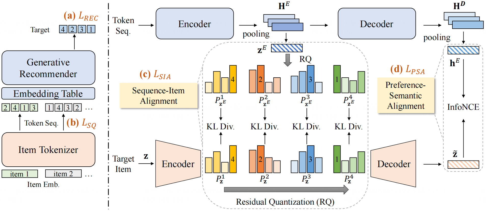

# ETEGRec

**[English README](./README.md)**

这是论文的官方 PyTorch 实现：

> [Generative Recommender with End-to-End Learnable Item Tokenization](https://doi.org/10.1145/3726302.3729989)

## 概述

我们提出了 **ETEGRec**，一个新颖的**端到端生成式推荐系统**，将物品标记化和生成式推荐统一到一个协同框架中。ETEGRec 基于双编码器-解码器架构，由物品标记器（Item Tokenizer）和生成式推荐器（Generative Recommender）组成。为了实现这两个组件之间的协同交互，我们提出了面向推荐的对齐策略，包括两个关键优化目标：序列-物品对齐和偏好-语义对齐。这些目标紧密耦合了物品标记器和生成式推荐器的学习过程，促进相互增强。此外，我们开发了交替优化技术，确保整个框架的稳定和高效的端到端训练。



## 环境要求

```bash
pip install -r requirements.txt
```

主要依赖：
- `torch==2.4.0+cu121`
- `numpy`
- `accelerate`
- `faiss-gpu`
- `recbole`
- `transformers`
- `sentence-transformers`

## 快速开始

### 方式一：使用预处理数据（推荐）

从 [Google Drive](https://drive.google.com/drive/folders/1KiPpB7uq7eFc4qB74cFOxhtY3H8nWgAI?usp=sharing) 下载预处理好的数据：
- SASRec 嵌入
- 预训练的 RQVAE 权重
- 交互数据（train/valid/test 划分）

然后直接跳到 [步骤 3：联合训练](#步骤-3联合训练标记器--推荐器)。

### 方式二：从头处理数据

按照下面的完整流程操作。

---

## 完整训练流程

### 步骤 1：数据准备

将原始 Amazon 评论数据处理成所需格式：

```bash
cd RecBole

# 对于 Amazon Musical Instruments 2018
python prepare_data_2018.py

# 对于其他数据集，使用相应的脚本：
# python prepare_data_2014.py  # 2014 版本
```

**功能说明：**
- 加载原始 Amazon JSON 数据
- 过滤至少有 5 次交互的用户/物品
- 将数据划分为 train/valid/test（leave-one-out 策略）
- 生成 RecBole 的 `.inter` 文件和 ETEGRec 的 `.jsonl` 文件

**输出文件**（位于 `RecBole/dataset/<数据集名称>/`）：
- `<数据集名称>.inter` - RecBole 格式，带划分标签
- `<数据集名称>.train.jsonl` - 训练序列
- `<数据集名称>.valid.jsonl` - 验证序列
- `<数据集名称>.test.jsonl` - 测试序列

### 步骤 2：生成嵌入

#### 2.1 生成协同嵌入（SASRec）

训练 SASRec 模型生成物品协同嵌入：

```bash
cd RecBole
python train_sasrec.py
```

**功能说明：**
- 在训练集上训练 SASRec
- 使用验证集进行早停
- 从训练好的模型中提取物品嵌入

**输出文件**（位于 `RecBole/dataset/<数据集名称>/`）：
- `<数据集名称>_emb_256.npy` - 物品协同嵌入（256 维）
- `<数据集名称>.emb_map.json` - 物品 ID 到嵌入索引的映射

**需要修改的关键参数**（在 `train_sasrec.py` 中）：
```python
BASE_DIR = './dataset/Instrument2018_5090'  # 修改数据集路径
DATASET_NAME = 'Instrument2018_5090'        # 修改数据集名称
```

#### 2.2 生成语义嵌入（文本）

使用句子转换器生成基于文本的语义嵌入：

```bash
cd RecBole
python generate_text_embeddings.py
```

**功能说明：**
- 加载物品元数据（标题、描述）
- 使用 sentence-transformers 生成语义嵌入
- 保存与协同嵌入对齐的嵌入

**输出文件**（位于 `RecBole/dataset/<数据集名称>/`）：
- `<数据集名称>_sentence-transformer_text_768.npy` - 语义嵌入（768 维）

**需要修改的关键参数**（在 `generate_text_embeddings.py` 中）：
```python
DATASET_NAME = 'Instrument2018_5090'
MODEL_NAME = "sentence-transformers/sentence-t5-base" # 或其他模型
```

### 步骤 3：预训练 RQVAE（物品标记器）

训练残差量化变分自编码器（RQVAE）进行物品标记化：

```bash
cd RQVAE

# 方式 A：单一嵌入（仅协同）
bash run_pretrain.sh

# 方式 B：双重嵌入（协同 + 语义）- 推荐
bash run_dual.sh
```

**需要修改的关键参数**（在 `run_pretrain.sh` 或 `run_dual.sh` 中）：

```bash
# 数据集路径
COLLAB_PATH="../RecBole/dataset/Instrument2018_5090/Instrument2018_5090_emb_256.npy"
SEMANTIC_PATH="../RecBole/dataset/Instrument2018_5090/Instrument2018_5090_sentence-transformer_text_768.npy"

# 模型架构
--num_emb_list 256 256 256    # 每个 RQ 层的码本大小
--layers 1024 512 256          # 编码器/解码器隐藏层维度
--e_dim 128                    # 嵌入维度

# 训练参数
--batch_size 2048              # 根据 GPU 显存调整
--epochs 10000                 # 最大轮数（启用早停）
--device cuda:0                # GPU 设备
```

**输出文件**（位于 `RQVAE/rqvae_ckpt/<数据集名称>/`）：
- `best_collision_*.pth` - 最佳模型检查点（最低冲突率）
- `best_gini_*.pth` - 最佳模型检查点（最佳码本利用率）

**监控指标：**
- 冲突率（Collision rate）：越低越好（目标 < 1%）
- 基尼系数（Gini coefficient）：越低越好（码本使用更均匀）

### 步骤 4：联合训练（标记器 + 推荐器）

使用端到端优化训练完整的 ETEGRec 模型：

#### 4.1 配置训练参数

编辑数据集的配置文件：

```bash
# 编辑 config/Instrument2018_5090.yaml
vim config/Instrument2018_5090.yaml
```

**需要修改的关键参数：**

```yaml
# 数据集路径
dataset: Instrument2018_5090
data_path: ./RecBole/dataset

# 嵌入路径（必须与步骤 2 的输出匹配）
semantic_emb_path: Instrument2018_5090_emb_256.npy
collab_emb_path: Instrument2018_5090_emb_256.npy
text_emb_path: Instrument2018_5090_sentence-transformer_text_768.npy

# RQVAE 检查点（必须与步骤 3 的输出匹配）
rqvae_path: ./RQVAE/rqvae_ckpt/DualSCID/Dec-23-2025_13-49-09/best_collision_0.0056_gini_0.2534.pth

# 训练超参数
epochs: 400
batch_size: 512
lr_rec: 0.005      # 推荐器学习率
lr_id: 0.0001      # 标记器学习率
cycle: 2           # 交替优化周期

# 损失权重
rec_kl_loss: 0.0001
rec_dec_cl_loss: 0.0003
id_kl_loss: 0.0001
id_dec_cl_loss: 0.0003
```

#### 4.2 配置多 GPU 训练（可选）

编辑 accelerate 配置：

```bash
vim accelerate_config_ddp.yaml
```

```yaml
distributed_type: MULTI_GPU
gpu_ids: '0,1'           # 指定 GPU ID
num_processes: 2         # GPU 数量
main_process_port: 33211 # 如有端口冲突请修改
```

单 GPU 配置：
```yaml
distributed_type: NO
gpu_ids: '0'
num_processes: 1
```

#### 4.3 运行训练

```bash
bash run.sh
```

**功能说明：**
- 加载预训练的 RQVAE 标记器
- 初始化生成式推荐器
- 在优化标记器和推荐器之间交替
- 应用序列-物品对齐和偏好-语义对齐

**输出文件**（位于 `myckpt/<数据集名称>/<时间戳>/`）：
- `*.pt` - 每个评估步骤的模型检查点
- 训练日志位于 `logs/<数据集名称>/`

**`run.sh` 中的关键参数：**
```bash
DATASET=Instrument2018_5090  # 修改数据集名称

# 超参数（可覆盖配置文件）
--lr_rec=0.005
--lr_id=0.0001
--cycle=2
--eval_step=2
```

### 步骤 5：强化学习（可选）

使用组相对策略优化（GRPO）微调模型：

#### 5.1 配置 GRPO

编辑 `run_grpo.sh`：

```bash
DATASET=Instrument2018_5090

# 指定步骤 4 的 SFT 检查点
SFT_CKPT=./myckpt/${DATASET}/Dec-04-2025_00-55-5925d6/11.pt

# GRPO 超参数
--grpo_group_size=2        # 每组样本数
--grpo_kl_coeff=0.05       # KL 散度系数
--grpo_temperature=1.0     # 采样温度
--grpo_reward_alpha=0.5    # 奖励权重
--grpo_lr=1e-5             # 学习率
--grpo_epochs=20           # 最大轮数
--grpo_early_stop=5        # 早停耐心值
```

#### 5.2 运行 GRPO 训练

```bash
bash run_grpo.sh
```

**输出文件**（位于 `myckpt/<数据集名称>/<时间戳>_grpo/`）：
- GRPO 微调后的检查点

---

## 评估

模型在训练过程中自动评估。评估指标包括：
- `Recall@{1,5,10}` - 不同截断位置的召回率
- `NDCG@{5,10}` - 归一化折损累积增益

结果记录到：
- 控制台输出
- `logs/<数据集名称>/` 中的日志文件
- Tensorboard（如果启用）

---

## 项目结构

```
ETEGRec/
├── RecBole/                    # 数据处理和 SASRec 训练
│   ├── dataset/               # 数据集存储
│   ├── prepare_data_2018.py   # 数据准备脚本
│   ├── train_sasrec.py        # SASRec 训练
│   └── generate_text_embeddings.py  # 文本嵌入生成
├── RQVAE/                     # 物品标记器（RQVAE）
│   ├── main.py               # RQVAE 训练脚本
│   ├── run_pretrain.sh       # 单一嵌入训练
│   └── run_dual.sh           # 双重嵌入训练
├── config/                    # 配置文件
│   └── Instrument2018_5090.yaml
├── main.py                    # 联合训练脚本
├── train_grpo.py             # GRPO 训练脚本
├── run.sh                    # 联合训练启动器
├── run_grpo.sh               # GRPO 启动器
└── accelerate_config_ddp.yaml # 多 GPU 配置
```

---

## 常见问题

### 常见错误

1. **CUDA 内存不足**
   - 减小配置文件中的 `batch_size`
   - 减小 `gradient_accumulation_steps`
   - 使用更少的 GPU 或更小的模型

2. **RQVAE 冲突率过高**
   - 增加 `--sk_epsilons`（例如 0.003）
   - 增加 `--kmeans_iters`（例如 500）
   - 使用更大的码本大小

3. **推荐性能差**
   - 检查 RQVAE 检查点质量（冲突率 < 1%）
   - 验证配置中的嵌入路径
   - 调整损失权重（`rec_kl_loss`、`rec_dec_cl_loss` 等）

4. **训练不稳定**
   - 降低学习率（`lr_rec`、`lr_id`）
   - 增加 `warmup_steps`
   - 调整 `cycle` 参数

---